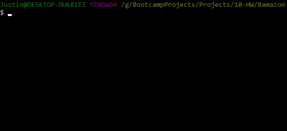
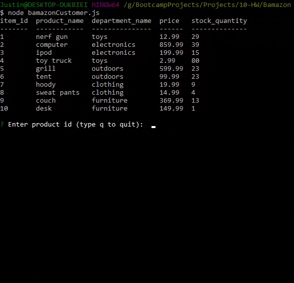

# Bamazon
        The original purpose of this project was to teach myself mySQL,
    and to make a working back-end application that will be able to track 
    inventory and organize products.  I created three different views
    for the data: customer, manager, and supervisor.  

# Getting Started
These instructions will get you a copy of the project up and running on your local machine.

    *Prerequisites:
        You will need both MAMP (https://www.mamp.info/en/) and an app for your mySQL databases,
        I use HeidiSQL (https://www.heidisql.com/download.php)

    *Getting Bamazon Running:
        1. Clone this repository to your local machine, for help check out https://services.github.com/on-demand/github-cli/clone-repo-cli
        2. When it finishes downloading run "npm i" this will install the following npm packages that you will need for the app to run:
            *console.table
            *inquirer
            *mysql
        3. Next you will want to open your HeidiSQL, and copy paste the schema.sql file into the query line to seed/set up the databases.  
        (Don't forget to hit run!!!)
        4. Now you are all set up to run any of the 3 options

# How It Works Walkthrough:
    After set up you have 3 files you get to choose from to start up with node: bamazonCustomer.js, bamazonManager.js, and bamazonSupervisor.js.

    *bamazonCustomer.js:
        1. In your bash enter "node bamazonCustomer.js"
        
        2. select any item by it's item_id number, or hit q to quit
            *You will then be asked, "how many units do you want?" enter a number.
            *The app will tell you how many units you purchased and will go back to the start-up table
            *It will continue to do this until you quit.
        
    *bamazonManager.js

Built With
Dropwizard - The web framework used
Maven - Dependency Management
ROME - Used to generate RSS Feeds
Contributing
Please read CONTRIBUTING.md for details on our code of conduct, and the process for submitting pull requests to us.

Versioning
We use SemVer for versioning. For the versions available, see the tags on this repository.

Authors
Billie Thompson - Initial work - PurpleBooth
See also the list of contributors who participated in this project.

License
This project is licensed under the MIT License - see the LICENSE.md file for details

Acknowledgments
Hat tip to anyone whose code was used
Inspiration
etc